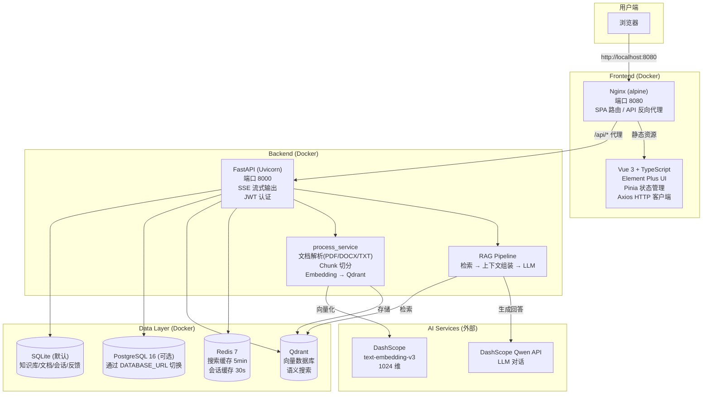

# AI Knowledge Base

一个面向 AI 全栈转岗训练的最小知识库项目。按周推进，把前端、后端、联调和业务页一步步串成完整闭环。

## 项目简介

- 第 1 周：搭建"能跑起来的后台项目骨架"
- 第 2 周：从骨架推进到"知识库管理后台雏形"
- 第 3 周：全面引入 Element Plus，升级为"具备产品感的系统"

到第 3 周结束时，项目已具备：
- 6 个页面全部使用 Element Plus 组件，风格统一
- 知识库列表支持搜索、状态筛选、分页
- 拖拽式文件上传 + 后端真实文件存储
- 面包屑导航、loading/空状态/错误反馈完善

## 技术栈

### Frontend

- Vue 3 + TypeScript
- Vite
- Vue Router
- Pinia
- Axios
- **Element Plus（全面落地）** — ElTable / ElForm / ElUpload / ElPagination / ElSelect / ElBreadcrumb / ElCard / ElTag / ElStatistic / ElMessage / ElAlert

### Backend

- FastAPI
- Pydantic
- Uvicorn
- python-multipart（文件上传）

## 当前已完成功能

### 前端（第 1 周）

- 登录页 `/login`
- 后台主布局（侧边栏 + 顶部栏）
- 工作台页 `/dashboard`
- 知识库列表页 `/knowledge-bases`
- 登录态管理与路由守卫
- 基于真实后端接口的登录联调
- 顶部栏显示后端返回的用户信息

### 前端（第 2 周新增）

- 新建知识库页 `/knowledge-bases/create` — 表单 + 验证 + 后端联调
- 文档列表 / 状态页 `/knowledge-bases/:id/documents` — 真实接口渲染
- 文档上传页 `/knowledge-bases/:id/upload` — 文件选择 + 上传入口

### 前端（第 4 周新增）

- **Pinia 认证 Store**：登录/登出/fetchMe + localStorage token 持久化 + initAuth 初始化恢复
- **axios 拦截器**：请求自动注入 `Authorization: Bearer` header、401 响应自动跳转登录页
- **路由守卫**：Vue Router 全局前置守卫检查 isLoggedIn，未登录重定向到 `/login`
- **文档搜索**：文档列表页新增 `ElInput` 搜索框（300ms debounce） + snippet 高亮展示 + 搜索与状态筛选联动 + 搜索结果分页

### 前端（第 5 周新增）

- **文档处理按钮**：文档列表页每行新增"处理"按钮，调用 `POST /documents/{id}/process` 触发解析→切片→向量化→入库全流程
- **处理状态自动轮询**：触发处理后每 2 秒自动轮询文档列表，直到无文档处于"处理中"状态
- **文档内容查看**：新增"查看"按钮，`el-dialog` 弹窗展示文档解析后的文本内容
- **状态标签配色统一**：待处理→灰色、处理中→蓝色、已完成→绿色、处理失败→红色
- **状态筛选选项修复**：filter 值与后端 `_status_label` 对齐，新增"处理失败"选项

### 前端（第 7 周新增）

- **知识库设置页** `/knowledge-bases/:id/settings` — 检索参数（Top‑k/阈值）、Prompt 编辑、模型参数（temperature/max_tokens/model）、Hybrid Search 开关与权重、Rerank 开关与 top_k，全部页面可配，实时生效
- **Chat 反馈按钮** — 每条 AI 回复下方 👍 👎 按钮，点击即发送反馈，支持切换和备注
- **效果对比页** `/knowledge-bases/:id/compare` — 双栏并列展示两组不同参数配置的检索 + 回答结果，含指标标签
- **会话管理** — 左侧会话列表，支持新建/切换对话

### 前端（第 3 周新增）

- **知识库列表页** — 全面 EP 化：`ElTable` + `ElPagination` 分页 + `ElInput` 搜索（300ms debounce）+ 搜索与分页联动
- **新建知识库页** — `ElForm` 内置验证规则（必填/长度/纯空格检测），创建成功后跳转到文档列表页
- **文档列表页** — `ElTable` + `ElTag` 状态标签 + `ElSelect` 状态筛选（全部/已完成/解析中/待处理）
- **文档上传页** — `ElUpload` 拖拽上传 + 50MB 限制 + 真实后端 `UploadFile` 文件存储 + 上传成功自动跳转
- **工作台页** — `ElCard` + `ElStatistic` 展示概览数据
- **登录页** — `ElForm` + `ElInput` + `ElButton` + `ElAlert` 错误提示 + 表单验证
- **面包屑导航** — `ElBreadcrumb` 动态显示页面路径
- 所有页面统一 loading、空状态、错误提示

### 后端（第 1 周）

- `GET /health`
- `POST /api/login`
- `GET /api/me`
- `GET /api/knowledge-bases`
- 统一接口返回格式
- 基础 CORS
- 最小 mock 用户与知识库数据

### 后端（第 2 周新增）

- `POST /api/knowledge-bases` — 新建知识库
- `GET /api/knowledge-bases/{id}` — 知识库详情
- `GET /api/knowledge-bases/{id}/documents` — 文档列表
- `POST /api/knowledge-bases/{id}/documents` — 上传文档（name 字段占位）
- 内存数据结构的 CRUD 雏形

### 后端（第 3 周新增）

- `GET /api/knowledge-bases` — 新增 `keyword`、`page`、`page_size` 参数（名称/描述过滤 + 分页）
- `GET /api/knowledge-bases/{id}/documents` — 新增 `status` 筛选参数
- `POST /api/knowledge-bases/{id}/documents` — 升级为 `UploadFile` 真实文件上传，保存到 `uploads/{kb_id}/`
- 静态文件服务挂载 `/uploads`
- `config.py` 新增 `UPLOAD_DIR` 配置

### 后端（第 4 周新增）

- **数据库基础设施**：SQLite + SQLAlchemy 2.0 ORM，User / KnowledgeBase / Document 三表模型
- **JWT 认证**：python-jose JWT 签发 + bcrypt 密码哈希 + OAuth2PasswordBearer + Depends 依赖注入保护所有路由
- **文档解析流水线**：PyMuPDF（fitz）PDF 逐页提取 + TXT 编码回退读取，状态流转 pending → parsing → completed / failed
- **FTS5 全文搜索**：SQLite FTS5 虚拟表 + MATCH 查询 + snippet 高亮 + JOIN documents 表获取状态/时间
- **新增接口**：`GET /content` 文档内容查看、`GET /search` 关键词搜索（支持 status 筛选 + 分页）

### 后端（第 5 周新增）

- **文档解析流水线升级**：新增 Word (.docx) 解析支持；状态标签从 `parsing` 改为 `processing`
- **Chunk 切分服务**：`chunk_service.py` 实现 `chunk_text()` 固定大小滑动窗口 + `recursive_chunk_text()` 段落→句子→固定回退；每个 chunk 携带完整元数据（doc_id / kb_id / chunk_index / page_number）
- **向量化与 Qdrant 集成**：`vector_service.py` 封装 Embedding API（DashScope text-embedding-v3, 1024 维）+ Qdrant collection 自动创建、batch upsert、语义搜索、按 kb_id 过滤、按 doc_id 删除
- **全流程编排**：`process_service.py` 串联 parse → chunk → embed → Qdrant → FTS；`POST /documents/{id}/process` 接口手动触发；幂等处理（重复触发先删后插）
- **语义检索**：`POST /api/knowledge-bases/{id}/search` 接口，支持 query + top_k + kb_id 过滤
- **配置泛化**：从 OpenAI 专用配置迁移为通用 `EMBEDDING_API_KEY`/`EMBEDDING_BASE_URL`/`EMBEDDING_MODEL`/`EMBEDDING_DIMENSION`
- **Docker Compose Qdrant**：`docker-compose.yml` 增加 Qdrant 服务（端口 6333/6334，数据持久化到 `data/qdrant/`）
- **Pre-commit 规范**：`.pre-commit-config.yaml` + ruff 格式化/排序 + prettier 前端格式化

### 后端（第 7 周新增）

- **知识库配置系统**：`knowledge_base_settings` 表 + `GET/PUT /api/knowledge-bases/{id}/settings` 接口，支持检索/Prompt/模型/Hybrid Search/Rerank 全量参数配置
- **检索参数实时生效**：Chat/Search/Stream 接口统一通过 `_get_or_create_settings()` 读取配置，修改后即时生效
- **Hybrid Search**：`vector_service.hybrid_search()` 实现向量 + FTS5 关键词按 alpha 权重融合
- **Metadata Filter**：检索支持按 `filename` 和 `status` 过滤（Qdrant payload 精确匹配）
- **Rerank 服务**：`rerank_service.py` 实现关键词密度+向量分数融合策略，无需额外 API
- **Retrieval 指标**：`compute_retrieval_metrics()` 返回命中数、得分分布、耗时，通过 SSE `metrics` 事件推送到前端
- **回答反馈**：`POST /api/knowledge-bases/{id}/chat/feedback` 接口，支持提交/切换 thumbs_up/thumbs_down
- **A/B 对比**：`POST /api/knowledge-bases/{id}/chat/compare` 并行运行两组参数配置，返回两路结果
- **SSE 流式升级**：`chat_stream()` 新增 `metrics` SSE 事件类型

### 联调情况

- 登录页已接入真实后端 `POST /api/login`（JWT 认证）
- 页面初始化可调用 `GET /api/me`（Token 鉴权）
- 知识库列表已通过 `GET /api/knowledge-bases` 渲染真实数据（支持搜索 + 分页）
- 新建知识库已调用 `POST /api/knowledge-bases` 并跳转到文档列表页
- 文档列表已调用 `GET /api/knowledge-bases/{id}/documents` 并渲染（支持状态筛选）
- 文件上传已调用 `POST /api/knowledge-bases/{id}/documents`（`UploadFile`）并保存到磁盘
- PDF/TXT 上传后自动解析，状态从"解析中"流转到"已完成"或"解析失败"
- 文档内容搜索已联调 `GET /api/knowledge-bases/{id}/search`，支持关键词 + 状态联合筛选 + 分页

## 架构图



## 项目目录结构

```text
ai-knowledge-base/
  frontend/          # Vue 3 前端项目
    Dockerfile       # 多阶段构建 (node:22 → nginx:alpine)
    nginx.conf       # SPA + /api + /uploads 反向代理
    .dockerignore
    src/
      views/         # 10 个业务页面
      api/           # Axios 接口封装（含错误拦截器）
      router/        # 路由配置 + 守卫
      stores/        # Pinia 状态管理
      components/    # ErrorBoundary, EmptyState 等通用组件
      utils/         # toast.ts 封装 ElMessage/ElNotification
  backend/           # FastAPI 后端项目
    Dockerfile       # uv-based 构建 (python3.13-slim)
    .dockerignore
    app/
      api/routes/    # FastAPI 路由模块
      schemas/       # Pydantic 校验模型
      models/        # SQLAlchemy ORM 模型
      services/      # 文档解析、Chunk、向量、检索、Rerank
      core/          # 配置、数据库引擎、安全、Redis 客户端
    scripts/         # 测试脚本
  docs/              # 设计文档与执行计划
    architecture.md  # 架构说明
  docker-compose.yml # 全服务编排 (frontend+backend+qdrant+redis+pg)
  .env.example       # 环境变量模板
  README.md          # 项目总说明
```

### 说明

- `frontend/src/views/` — 10 个 Element Plus 业务页面
- `frontend/src/api/` — 后端接口封装（请求拦截器注入 JWT，响应拦截器统一处理 401/403/404/500）
- `frontend/src/router/` — 路由 + 守卫
- `frontend/src/stores/` — Pinia 状态管理
- `frontend/src/components/` — ErrorBoundary（全局错误兜底）、EmptyState（空状态引导）
- `backend/app/api/routes/` — FastAPI 路由
- `backend/app/schemas/` — Pydantic 数据模型
- `backend/app/models/` — SQLAlchemy ORM 模型
- `backend/app/services/` — 文档解析 + Chunk 切分 + 向量化 + 检索 + Rerank + 文档处理
- `backend/app/core/` — 配置、数据库引擎、安全模块、Redis 缓存客户端

以下目录主要属于本地开发环境产物，不是项目核心成果本身：

- `frontend/node_modules/`
- `frontend/dist/`
- `backend/.venv/`
- `.idea/`
- `__pycache__/`
- `uploads/`

## 容器化启动方式

### 前提条件

- Docker 24+
- Docker Compose v2+

### 快速启动（推荐）

```bash
# 克隆项目
git clone <repo-url> && cd ai-knowledge-base

# 可选：配置环境变量
cp .env.example .env
# 编辑 .env，至少设置 DASHSCOPE_API_KEY

# 一键启动所有服务
docker compose up -d

# 访问 http://localhost:8080
```

启动后的服务：

| 服务 | 地址 | 说明 |
|------|------|------|
| 前端 | http://localhost:8080 | Nginx 反向代理 |
| 后端 | http://localhost:8000 | FastAPI /health |
| Qdrant | localhost:6333 | 向量数据库 |
| Redis | localhost:6379 | 缓存层 |

默认使用 SQLite 数据库，如需 PostgreSQL 请运行：

```bash
docker compose --profile postgres up -d
```

并在 `.env` 中设置 `DATABASE_URL=postgresql://kbuser:kbpass@db:5432/knowledge_base`

### 本地开发模式

```bash
# 启动依赖服务（Qdrant + Redis）
docker compose up -d qdrant redis

# 启动后端（热重载）
cd backend
uv run uvicorn app.main:app --reload --host 0.0.0.0 --port 8000

# 启动前端（热重载）
cd frontend
npm run dev
```

后端默认运行在 `http://127.0.0.1:8000`，前端在 `http://localhost:5173`。API 通过 Vite proxy 转发到后端。

### 环境变量说明

| 变量 | 默认值 | 说明 |
|------|--------|------|
| `DASHSCOPE_API_KEY` | — | DashScope API 密钥（必填） |
| `JWT_SECRET` | `super-secret-key-change-in-production` | JWT 签名密钥 |
| `DATABASE_URL` | `sqlite:///{BASE_DIR}/knowledge_base.db` | 数据库连接串（Docker 默认 `/app/data/knowledge_base.db`） |
| `QDRANT_URL` | `http://localhost:6333` | Qdrant 服务地址 |
| `REDIS_URL` | — | Redis 连接串（空=不使用缓存） |
| `CACHE_ENABLED` | `true` | 是否启用 Redis 缓存 |
| `LLM_API_KEY` | 同 `DASHSCOPE_API_KEY` | 大模型 API Key |
| `LLM_BASE_URL` | `https://dashscope.aliyuncs.com/compatible-mode/v1` | 大模型接口地址 |
| `LLM_MODEL` | `qwen-plus` | 大模型名称 |
| `EMBEDDING_MODEL` | `text-embedding-v3` | Embedding 模型名称 |
| `EMBEDDING_DIMENSION` | `1024` | 向量维度 |
| `COLLECTION_NAME` | `document_chunks` | Qdrant collection 名称 |
