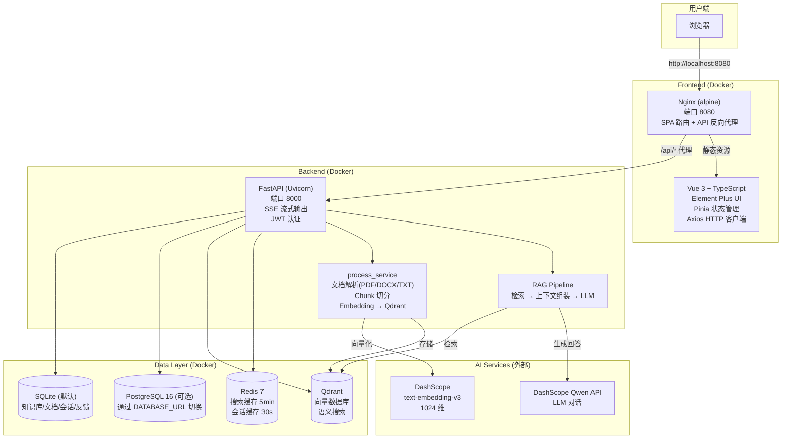
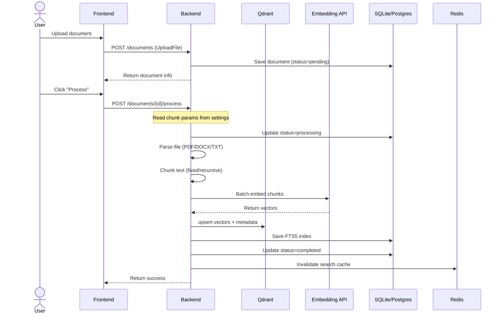
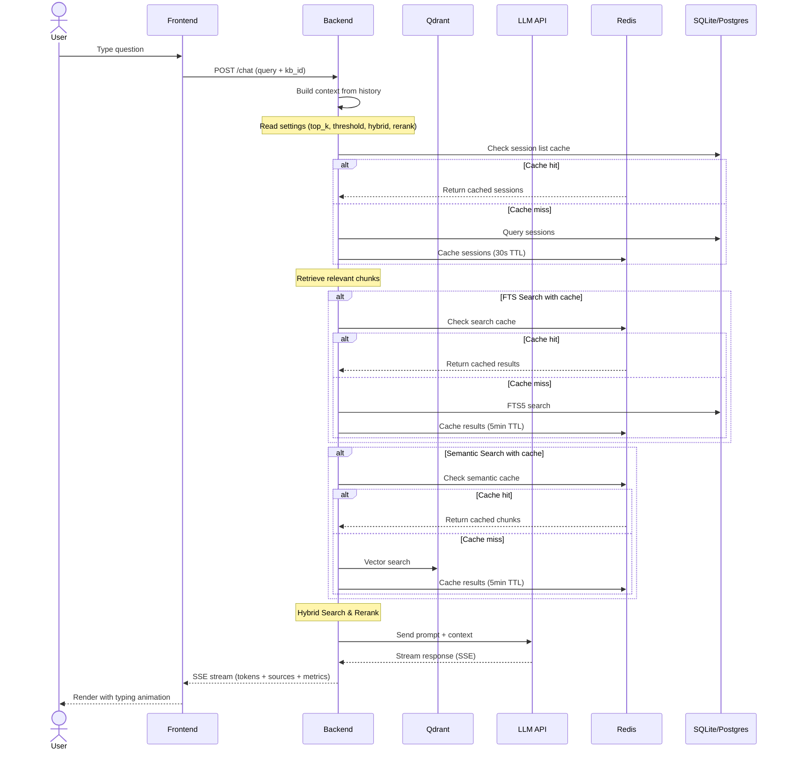
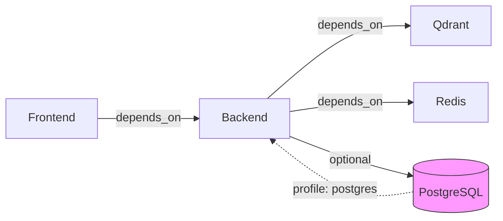

# Architecture — AI Knowledge Base

## System Architecture

## Data Flow

### Document Processing Flow

### Chat Q&A Flow

## Service Dependencies

## Docker Services

| Service | Image | Port | Storage | Profile |
|---------|-------|------|---------|---------|
| frontend | node:22 → nginx:alpine | 8080:80 | — | default |
| backend | uv:python3.13-slim | 8000:8000 | uploads (volume) | default |
| qdrant | qdrant/qdrant:latest | 6333, 6334 | qdrant-data (volume) | default |
| redis | redis:7-alpine | 6379 | redis-data (volume) | default |
| db | postgres:16-alpine | 5432 | postgres-data (volume) | `--profile postgres` |
